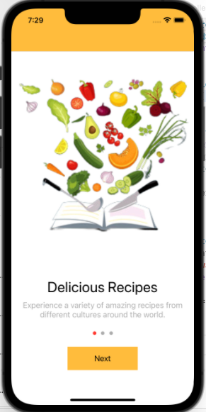
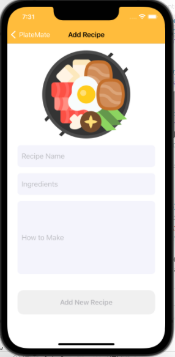
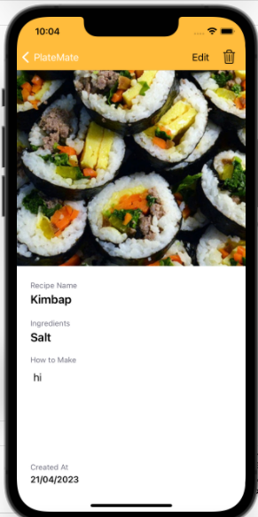
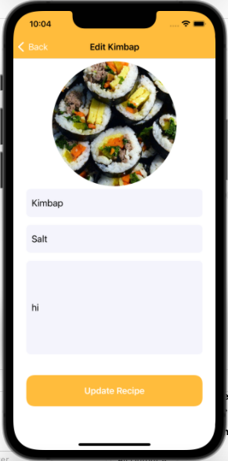
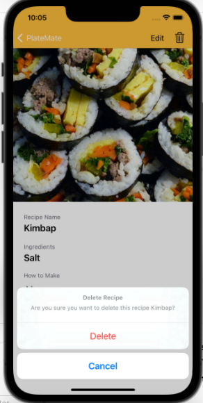

# Project Name - PlateMate

#### PlateMate is a recipe app designed to help users discover and share their favorite recipes. The app includes several features, including the ability to add, update, delete, and view recipes. The app includes a user-friendly interface that allows users to add new recipes to the app, including details such as the Recipe name, Ingredients, preparation instructions, and an image. In addition, users can also upload their own images to the app, allowing for a more personalized experience. The app's user-friendly interface and intuitive design make it easy to navigate and search for recipes. Users can also update or delete existing recipes as needed. Its integration with Core Data ensures efficient data management and storage.

1. App in the Home Screen

 

2. Launching Screen with App Logo

  

3. Page Control Slides 

 
 
 

4. All Recipes UI

 

5. Add recipe UI

 

6. View one recipe UI

 

7. Update recipe UI

 

12. Delete recipe

 
